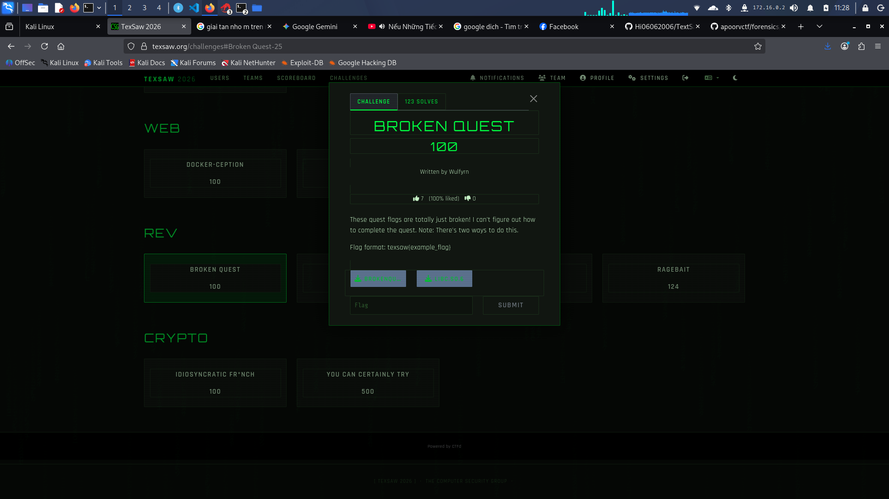

Mo file brokenrequest 
hân tích (Reconnaissance)
Khi chạy file binary, chương trình hiển thị một menu với 8 hành động (Rotate, Increase, Swap, v.v.) và yêu cầu người chơi thay đổi mảng `Current Values: [0 0 0 0 0 0 0 0]` thành một trạng thái đích bí mật để có thể chọn `0: Turn in Quest` và lấy cờ.

Sử dụng Ghidra/IDA để decompile file thực thi, tôi tìm thấy hàm `main` và phát hiện ra **Trạng thái đích (Target State)** đã bị lộ ngay trong code khởi tạo:

```c
  local_38 = 2;
  local_34 = 6;
  local_30 = 0xfffffffc; // -4
  local_2c = 6;
  local_28 = 0;
  local_24 = 4;
  local_20 = 0xfffffffd; // -3
  local_1c = 1;
```
1.Mở file bằng GDB: `gdb ./brokenquest`

2.Đặt breakpoint tại hàm kiểm tra: `b turn_in`

3.Chạy chương trình (run), nhập 0 (Turn in Quest) để trigger breakpoint.

4.Ghi đè bộ nhớ bằng các lệnh sau trong GDB (ép kiểu con trỏ C):

```set *(int*)($rdi) = 2
set *(int*)($rdi + 4) = 6
set *(int*)($rdi + 8) = -4
set *(int*)($rdi + 12) = 6
set *(int*)($rdi + 16) = 0
set *(int*)($rdi + 20) = 4
set *(int*)($rdi + 24) = -3
set *(int*)($rdi + 28) = 1`
```
ket qua : `texsaw{1t_ju5t_work5_m0r3_l1k3_!t_d0e5nt_w0rk}`


