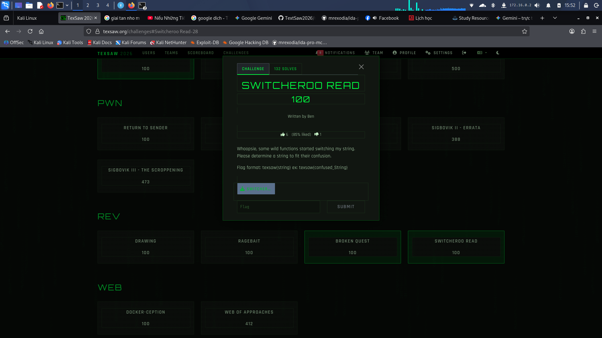

Mo file switcheroo

Dấu hiệu ban đầu: File thực thi Linux 64-bit yêu cầu một chuỗi flag dài 27 ký tự.

Hàm chính (FUN_00401850): Nhận input từ người dùng qua scanf với giới hạn 27 ký tự và truyền vào hàm xử lý tiếp theo.

Chuỗi Strings: Xuất hiện các chuỗi hệ thống và tên tệp README.txt, gợi ý chương trình sẽ tương tác với file này sau khi biến đổi input.


Ham `FUN_00401850 (Main)` :Hiển thị yêu cầu nhập mật khẩu và kiểm tra độ dài

FUN_00401729: Bộ điều phối (Dispatcher): Gọi liên tiếp các hàm biến đổi và kiểm tra các "chốt chặn" dọc đường.	Chứa các hằng số kiểm tra như 'o', 'R', 'Y', 's'.

FUN_004012df:Máy nghiền dữ liệu: Biến đổi giá trị ASCII của chuỗi dựa trên tham số bước nhảy (chẵn/lẻ).	Sử dụng toán tử + hoặc - ASCII kết hợp với việc gọi hàm hoán đổi vị trí.
FUN_004011b6: Hàm Switcheroo: Thực hiện dịch chuyển vòng các ký tự trong chuỗi (Circular Shift).	Dùng strcpy vào bộ đệm tạm và gán lại theo công thức (index + offset) % 27.
FUN_004013fd: Trạm kiểm soát cuối: Xác nhận xem chuỗi sau biến đổi có mở được file README.txt và khớp các giá trị số không.	Chứa logic fopen("README.txt") và so sánh các biến local_14, 18, 1c, 20.

Tu do ta su dung `z3`
```
from z3 import *

solver = Solver()
# Khởi tạo 27 biến symbol cho 27 ký tự của flag (8-bit)
flag = [BitVec(f'f_{i}', 8) for i in range(27)]

# 1. Khóa cứng Format Flag ở đầu vào
prefix = "texsaw{"
for i, c in enumerate(prefix):
    solver.add(flag[i] == ord(c))
solver.add(flag[26] == ord('}'))

# Giới hạn các ký tự ẩn nằm trong dải ASCII in được
for i in range(7, 26):
    solver.add(flag[i] >= 32, flag[i] <= 126)

# 2. Định nghĩa lại các hàm Switcheroo sang Python
def shift_right(arr, k):
    res = [0] * 27
    for i in range(27):
        res[(i + k) % 27] = arr[i]
    return res

def fun_12df(arr, param_2):
    if param_2 % 2 == 0:  # Chẵn
        for c in range(param_2):
            idx = (c * param_2) % 27
            arr[idx] += param_2
        arr = shift_right(arr, param_2)
    else:                 # Lẻ
        arr = shift_right(arr, param_2)
        for c in range(param_2):
            idx = (c + param_2) % 27
            arr[idx] -= param_2
    return arr

p = list(flag)

# 3. Mô phỏng hàm FUN_00401729 và các Trạm Kiểm Tra
p = fun_12df(p, 5)
p = fun_12df(p, 6)
solver.add(p[11] == ord('o'))

p = fun_12df(p, 13)
solver.add(p[14] == ord('R'))

p = fun_12df(p, 3)
p = fun_12df(p, 24)
solver.add(p[0] == 155) # -0x65 = 155 trong uint8

p = fun_12df(p, 10)
solver.add(p[8] == ord('Y'))
solver.add(p[11] == ord('Y'))

p = fun_12df(p, 7)
solver.add(p[20] == 181) # -0x4b = 181 trong uint8
solver.add(p[13] == ord('s'))

# 4. Trạng thái Trùm Cuối tại FUN_004013fd
# Đã giải sẵn phương trình từ C ra các giá trị đích
target_values = {
    0: 115, 1: 101, 2: 105, 3: 30, 5: 146, 6: 51,
    7: 94, 8: 127, 9: 96, 10: 38, 11: 171, 12: 49,
    21: 118, 22: 65, 23: 174, 24: 49, 25: 101, 26: 192
}
for idx, val in target_values.items():
    solver.add(p[idx] == val)

# 5. Ép máy tính nhả Flag!
print("Đang giải mã...")
if solver.check() == sat:
    m = solver.model()
    result = "".join(chr(m[flag[i]].as_long()) for i in range(27))
    print(f"\n🎉 BÙM! Flag của bạn là: {result}")
else:
    print("\nKhông tìm thấy flag, thử thách này quá lắt léo!")
```
flag : 


